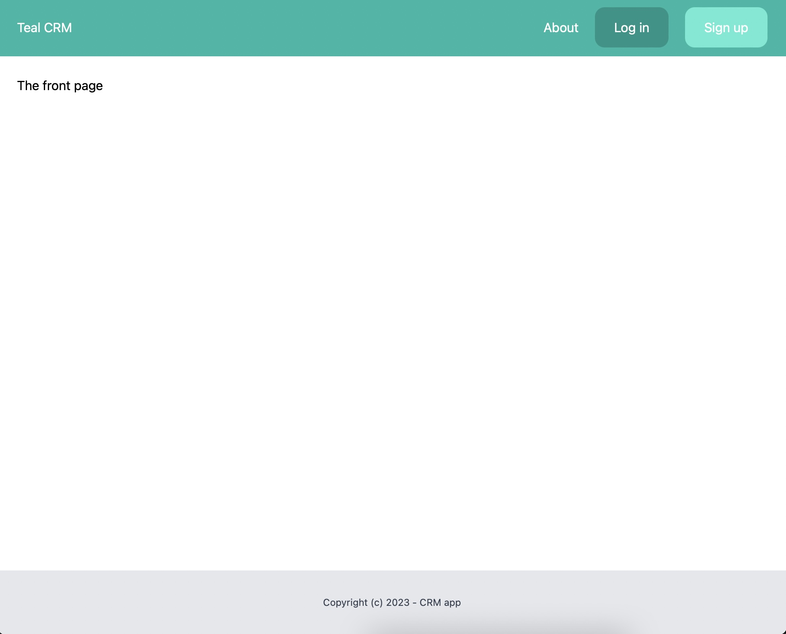
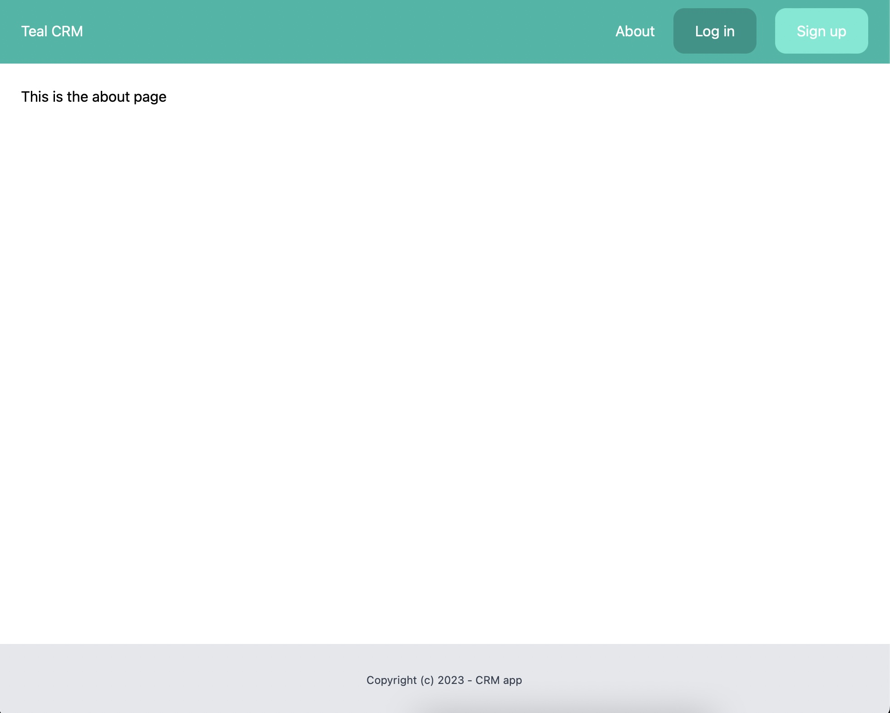

# A CRM app, where you can create leads, clients and manage them

# This is a CRM app that allows to:
1. Sign up
2. Log in
3. Apply CRUD operations to leads
4. Apply CRUD operations to clients
5. Convert leads to clients
6. Change the pre-assigned, default team name
7. Change teams, if the user is a member of more than 1 team
8. Apply restrictions to numbers of allowed leads and clients for the basic, default plan

<dev align="center">
    

        The front page
    

    
</dev>

    The about page:
     
    

